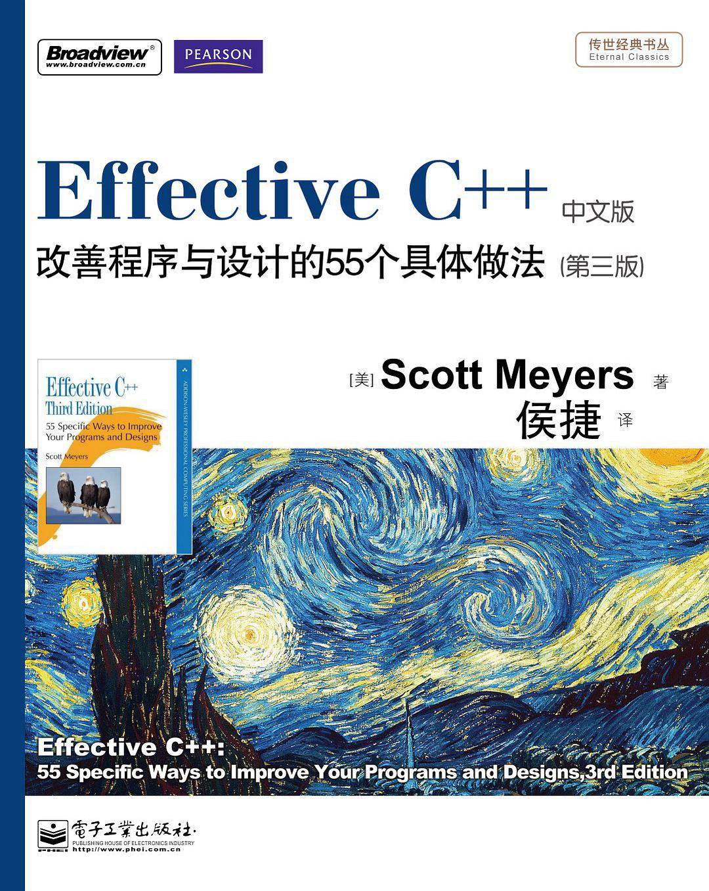

# Effective C++

## 内容简介

---

​         有人说C++程序员可以分为两类，读过Effective C++的和没读过的。世界C++大师Scott Meyers成名之作的第三版的确当得起这样的评价。当您读过《Effective C++：改善程序与设计的55个具体做法（第3版）（中文版）（双色）》之后，就获得了迅速提升自己C++功力的一个契机。
　　在国际上，本书所引起的反响，波及整个计算机技术的出版领域，余音至今未绝。几乎在所有C++书籍的推荐名单上，《Effective C++：改善程序与设计的55个具体做法（第3版）（中文版）（双色）》都会位于前三名。作者高超的技术把握力、独特的视角、诙谐轻松的写作风格、独具匠心的内容组织，都受到极大的推崇和仿效。这种奇特的现象，只能解释为人们对这本书衷心的赞美和推崇。
　　《Effective C++：改善程序与设计的55个具体做法（第3版）（中文版）（双色）》不是读完一遍就可以束之高阁的快餐读物，也不是用以解决手边问题的参考手册，而是需要您去反复阅读体会的，C++是真正程序员的语言，背后后精神的思想与无以伦比的表达能力，这使得它具有类似宗教般的魅力。希望这本书能够帮您跨越C++的重重险阻，领略高处才有的壮美风光，做一个成功而快乐的C++程序员。

## 作者

---

- Scott Meyers

  > 全世界知名的C++软件开发专家之一。他是畅销书《Effective C++》系列（Effective C++，More Effective C++，Effective STL）的作者，又是创新产品《Effective C++ CD》的设计者和作者，也是Addison-Wesley的“Effective Software Development Series”顾问编辑，以及《Software Development》杂志咨询板成员。他也为若干新公司的技术咨询板提供服务。Meyers于1993年自Brown大学获得计算机博士学位

## 内容摘录

---

- “促进正确使用”的方法包括接口的一致性，以及与内置类型的行为兼容
-  “阻止误用”的方法包括建立新类型、限制类型上的操作，束缚对象值，以及消除客户的资源管理责任

## 读书心得

---

xxxxxxx

